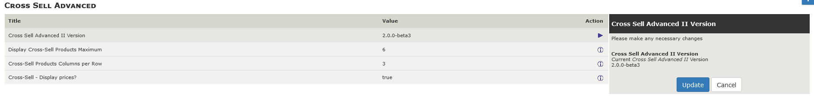
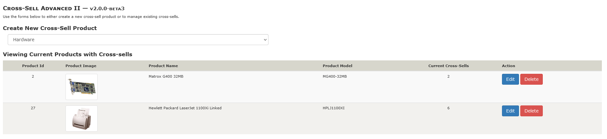
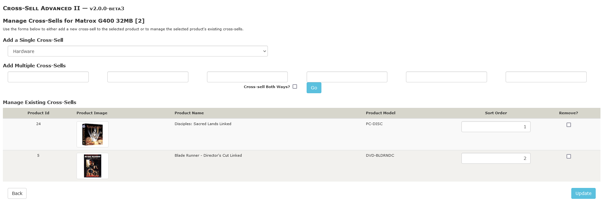

# Cross Sell Advanced II: Admin Interfaces

## Configuration Settings

The plugin includes an auto-loading installation script that creates (or updates) various configuration settings and database tables used by the plugin.  A new table (`products_xsell`) is created that maps a primary product, via its `products_id`, to other `products_id` values as cross-sell products.

A new set of configuration settings (***Cross Sell Advanced II***) enables an admin to control the storefront display of any product cross-sells:

| Configuration Title                 | Default | Description                                                  |
| ----------------------------------- | ------- | ------------------------------------------------------------ |
| Cross Sell Advanced II Version      | varies  | Displays the (read-only) current version of the plugin.      |
| Display Cross Sell Products Maximum | 6       | Identifies the maximum number of cross-sell products to display for a given product.  Set the value to `0` to disable the storefront display. |
| Cross-Sell Products Columns Per Row | 3       | Identifies the number of cross-sell products to display per storefront centerbox row. |
| Cross-Sell: Display Prices?         | false   | Indicates whether (`true`) or not (`false`) to include the price of each cross-sell product on the storefront display. |

## Using the Cross Sell Advanced II Tool

The `Catalog :: Cross Sell Advanced II` tool provides an admin with the means to define the cross-sell product relationships.  On initial entry to the tool, a form is provided through which a new product with cross-sells can be defined and the current products with cross-sells are displayed:

From that display, the admin creates a new cross-sell product by choosing a current product category and then a specific product.  On selection (and clicking the associated "New" button) or by clicking the "Edit" button associated with a currently-defined product with cross-sells, the tool's cross-sell manager displays.  Clicking the "Delete" button for a currently-defined product with cross-sells results (after confirmation) in that product's cross-sells being removed.

The tool's cross-sell manager provides a display similar to:

It's through this page of the tool that an admin can manage the products to be cross-sold for the current 'main' product; for the above case, it's for the **Matrox G400 32MB** product.

| Form Section                | Usage Description                                            |
| --------------------------- | ------------------------------------------------------------ |
| Add a Single Cross-Sell     | Use this form to select a current products' category and then a single product to be added as a cross-sell for the 'main' product. |
| Add Multiple Cross-Sells    | Use this form to add multiple (up to six at a time) products via their `products_model` as cross-sells for the 'main' product.  Ticking the **Cross Sell Both Ways?**  checkbox results in the 'main' product also being cross-sold for each selected product, too. |
| Manage Existing Cross-Sells | Use this form to either change the cross-sell product sort-orders for the 'main' product's cross-sells or remove one or more cross-sells from the 'main' product by ticking the **Remove?** checkbox for the to-be-removed product prior to clicking the "Update" button. |

## Exporting and Importing Cross Sell Definitions

***Cross Sell Advanced II*** also provides a Database I/O Manager handler (`DbIoProductsXsellHandler.php`) to enable the export and import of the `products_xsell` table via a `.csv` input.  The columns supported within that `.csv` are:

| Column Header    | Description                                                  |
| ---------------- | ------------------------------------------------------------ |
| v_products_id    | Used in conjunction with the `v_products_model` column to locate the main product to which the current row's cross-sell is to be applied.  See [Determining a Cross Sell Product](#determining-a-cross-sell-product) for additional information. |
| v_products_model | Used in conjunction with the `v_products_id` column to locate the main product to which the current row's cross-sell is to be applied.  See [Determining a Cross Sell Product](#determining-a-cross-sell-product) for additional information. |
| v_xsell_id       | Used in conjunction with the `v_xsell_model` column to locate the product to be added as a cross-sell to the current row's main product.  See [Determining a Cross Sell Product](#determining-a-cross-sell-product) for additional information. |
| v_sort_order     | The cross-sell sort order for the product/xsell combination. |
| v_xsell_model    | Used in conjunction with the `v_xsell_id` column to locate the product to locate the product to be added as a cross-sell to the current row's main product.  See [Determining a Cross Sell Product](#determining-a-cross-sell-product) for additional information. |
| v_dbio_command   | The DbIo command to apply to the current row.  See [DbIo Commands Supported](#dbio-commands-supported) for additional information. |

### Determining a Cross Sell Product

Each of the `.csv` file's id/model pairs provides a way to identify a specific product &mdash; either the main product to which the cross-sell is to be applied or the cross-sell product itself.  The specific product is identified as:

1. If the associated product's id (either `v_products_id` or `v_xsell_id`)  is supplied as a positive integer value, it's *presumed* that the value identifies the specific product.
2. Otherwise, the associated product's model (either `v_products_model` or `v_xsell_model`) is *presumed* to identify a unique product.  The model number must exist in the site's database and be used for a single product.

### DbIo Commands Supported

The DbIo handler supports an `ADD` and a `REMOVE` command.  An `ADD` command adds (if not already present in the database) a cross-sell between the main and cross-sell products identified in the command's row.  A `REMOVE` command removes (if present in the database) the cross-sell between the main and cross-sell products identified in the command's row.

***NOTE**: Cross sells can be added only via DbIo command.*