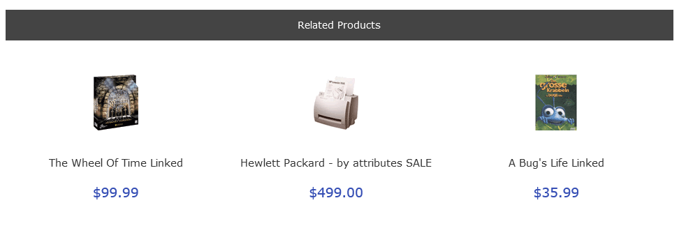

# Cross Sell Advanced II: Storefront Changes

Once you've installed and configured ***Cross Sell Advanced II*** for your site, displays of a product's details (e.g. on the `product_info` page) will include any cross-sell products you've assigned:

Remember that part of the plugin's installation requires hand-editing of the pages' template files (e.g. `tpl_product_info_display.php`).  See [this](./updating_your_template.md) documentation for additional information.